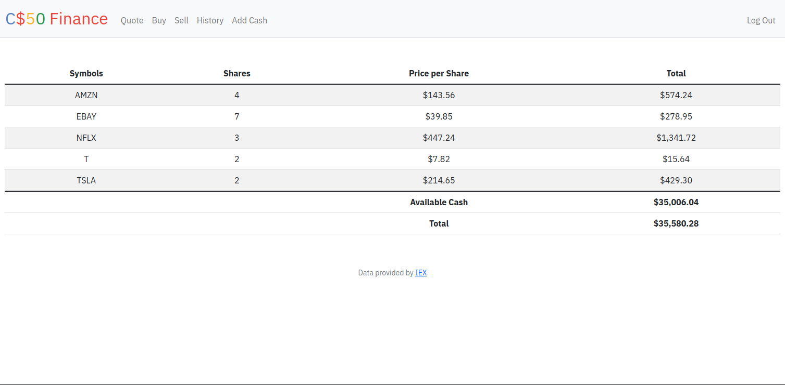
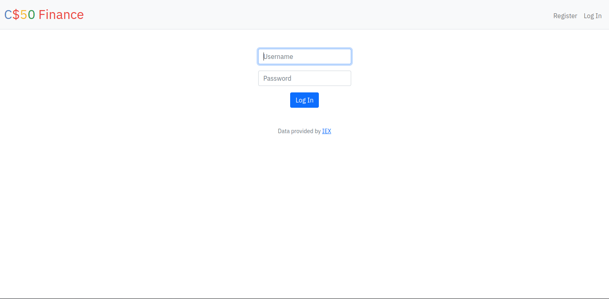
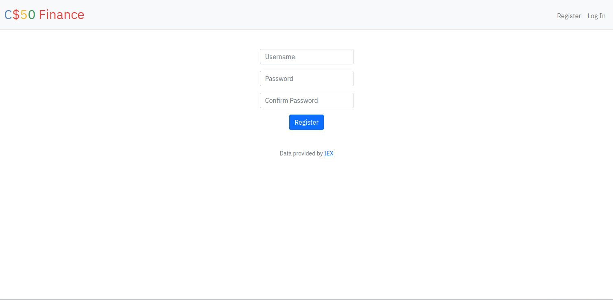

# **Finance: A Stock Portfolio**

View the full assignment description on [CS50's OpenCourseWare](https://cs50.harvard.edu/x/2024/psets/9/finance/).

### **Technologies**
- Python
- Flask
- HTML
- Bootstrap
- SQL

## **Summary**

Finance is a web application that allows logged-in users to "buy" and "sell" stocks using pretend money. Users can look up real stock quotes fetched from the IEX API and view their stock portfolio transaction history.

## **How to Run**

I ran the code in the CS50 Codespace because it requires the cs50 package, which provides essential functionalities for the application. Additionally, CS50 offers its own web server, simplifying the setup process. However, it is possible to run the application locally by substituting CS50-specific functions with equivalents from other packages.

## **Specification**

### register

Allows users to register for an account via a form.

- Input fields: username (text) and password (text).
- Handles duplicate usernames with try-except blocks.
- Hashes passwords using  generate_password_hash
- On success, inserts the new user into the users table and redirects to login.

### quote

Allows users to look up a stock’s current price.

- Input field: symbol (text).
- On GET request, renders a form for input.
- On POST request, renders the stock price using lookup.

### buy

Allows users to buy stocks.

- Input fields: symbol (text) and shares (text).
- Validates stock symbol and share count.
- Checks user’s cash balance and updates the database with the purchase details.
- Redirects to the home page on success.

### index

Displays the logged-in user's stocks, including the number of shares, current prices, and total values. Also shows the user's cash balance and total portfolio value.

### sell

Allows users to sell shares of owned stocks.

- Input fields: symbol (select menu) and shares (text).
- Validates stock ownership and share count.
- Updates the database with the sale details.
- Redirects to the home page on success.

### history

Displays a table summarizing all user transactions, including buys and sells, with details such as stock symbol, price, number of shares, and transaction date/time.